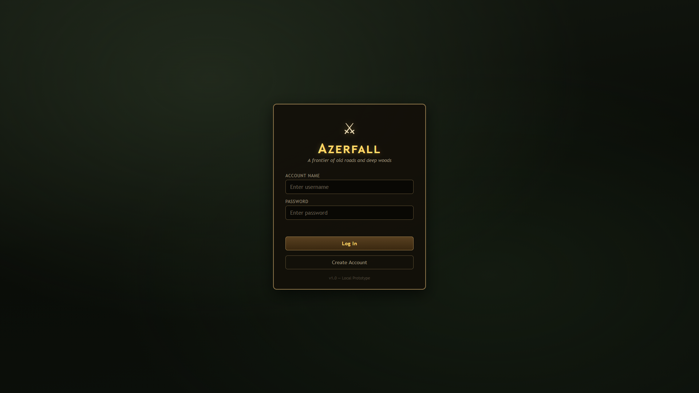
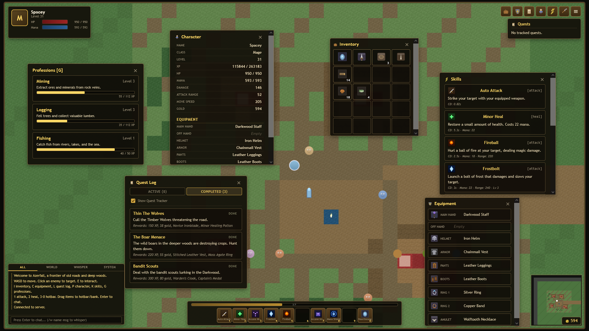
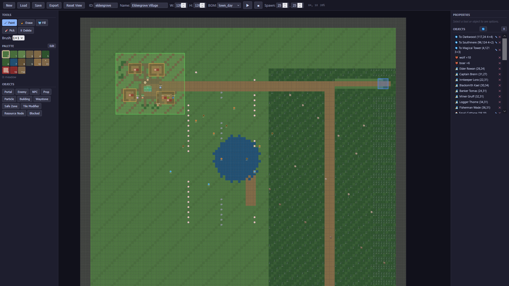
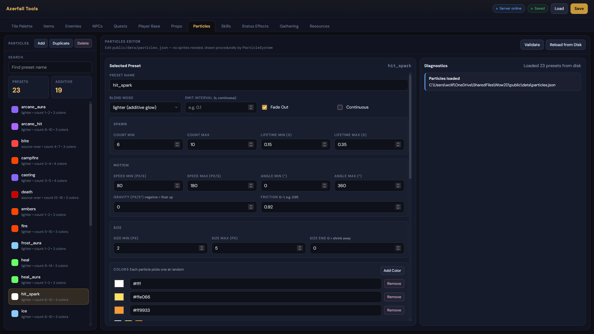
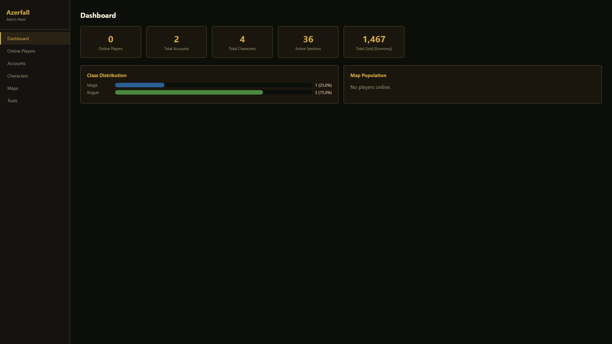

> **AI Disclaimer:** This project was completely built by AI. My main driving question was, can I create an entire MMORPG development eco-system in AI. Apparently yes. I made sure that the vast majority of features were extensible through the use of jsons. Using jsons made it easy for me to get AI to make tools assisting in world development. May God have mercy on all of us.

For clarity, background loops for music was not AI generated. Loops were found at the following link:
- https://pixabay.com/users/darren_hirst-47836735/

(I tried to get Suno to make songs for me, but I was unable to get it to make a good ambient soundscape.)

---

# Azerfall (WoW2D Prototype)

A browser-based top-down 2D fantasy RPG prototype inspired by early MMORPG starter-zone design. Features real-time multiplayer, persistent characters, data-driven world maps, and a classic quest/combat loop.


*The Azerfall login screen — create an account or log in to an existing one to enter the world.*

## Tech Stack

- **Client:** HTML5 Canvas (world rendering), JavaScript ES modules (game systems), CSS (HUD/layout)
- **Server:** Node.js + Express (HTTP & static files), `ws` (WebSocket multiplayer at 60 Hz), `better-sqlite3` (SQLite with WAL mode)
- **Data-driven:** All maps, enemies, items, NPCs, quests, particles, and tiles are defined in JSON files under `public/data/`

## Setup

1. Install dependencies:

```bash
npm install
```

2. Generate maps and assets (first time only, or after editing generators):

```bash
npm run generate
```

3. Start the server:

```bash
npm start
```

4. Open in your browser:

```
http://localhost:3000
```

## Controls

| Key | Action |
|---|---|
| `WASD` / Arrow keys | Move (8 directions) |
| Left-click enemy | Select target (does not attack) |
| Left-click player | Select target (friendly) |
| Right-click enemy | Select target and engage auto-attack |
| Right-click other player | Context menu: Whisper, Invite to Party, Add Friend, Block, Trade, Challenge to Duel (on PVP maps) |
| Right-click inventory item | Context menu: Equip, Use, Dismantle, or Drop |
| Click equipment slot | Unequip item back to inventory |
| `1` – `9`, `0` | Activate hotbar slots 1–10 (customizable: skills or items) |
| `E` | Interact with nearby NPC or waystone; auto-gather from resource nodes |
| `G` | Toggle professions panel |
| `I` | Toggle inventory |
| `C` | Toggle equipment panel |
| `L` | Toggle quest log |
| `P` | Toggle character sheet |
| `K` | Toggle skills panel |
| `O` | Toggle social window (friends, party, blocked) |
| `M` | Toggle full world map |
| `Enter` | Focus chat input |
| `Escape` | Close panels / game menu |

### Chat Commands

- `/w PlayerName message` — whisper to a player
- `/p message` — send a message to your party

## Gameplay


*In-game view showing the character sheet, professions panel, inventory with equipped gear, quest log, skills panel, equipment slots, hotbar, and chat — all overlaid on the tile-based world with enemies and resource nodes.*

## Features

### World & Exploration
- Four interconnected maps: Eldengrove (128×128), Darkwood Forest (80×80), Southmere, and Moonfall Cavern
- Portal system for seamless map transitions with server-side proximity validation
- Tile-based terrain with palette-driven rendering (grass, dirt, water, cliffs, roads, etc.)
- Buildings with tile-by-tile layouts and multi-floor interiors (stairs to go up/down)
- Props (trees, rocks, flowers, etc.) with data-driven blocking via `props.json`
- Safe zones
- Waystone system — attune your hearthstone to teleport back to town (floor-aware placement)
- Gathering system — mine ore, chop trees, and catch fish from resource nodes placed on maps
  - Three gathering professions: Mining, Logging, Fishing — each with independent XP and levels
  - Nine resource node types across three tiers (e.g., Copper Vein → Tin Vein → Iron Deposit)
  - Requires the correct tool type and tier in inventory (pickaxe, hatchet, or fishing rod)
  - Auto-gather with `E` key (2.5s cooldown between attempts) with green progress bar
  - Client-side tool validation before gathering begins
  - Professions panel (`G`) shows skill levels and XP progress
- Crafting system — process raw materials at crafting station NPCs
  - Three processing professions: Smelting, Milling, Cooking — each with independent XP and levels
  - Nine recipes across three tiers (e.g., Copper Bar, Tin Bar, Iron Bar for Smelting)
  - Interact with crafting station NPCs (Smelter Hilda, Sawyer Brom, Cook Marta) to open the crafting panel
  - Crafting timer with copper-themed progress bar
  - Continuous crafting mode — toggle to auto-repeat recipes
  - Recipes defined in `recipes.json` with skill requirements, input materials, and output items
- Procedural map generation via `generate-maps.js`

### Minimap & World Map
- Corner minimap (bottom-right) shows nearby terrain, enemies (red), other players (cyan), and your position (white) — all filtered by current floor
- Full world map (M key) displays the entire map with:
  - Player position (blinking white dot)
  - Portals (blue diamonds with labels)
  - Waystones (green diamonds)
  - Quest NPCs: available quests (!), in-progress (…), ready to turn in (?)
  - Safe zone outlines and legend

### Combat & Progression
- Target-then-engage combat: left-click to select a target, right-click or hotbar attack to engage auto-attack with chase
- Server-authoritative hit resolution
- Multiple enemy types with aggro range, chase AI, leashing, and wander behavior (floor-aware: enemies only aggro players on the same floor)
- Variable enemy sizes — enemies can span 1×1, 2×2, or 3×3 tiles via `tileSize` field, with automatic radius, AoE overlap, projectile hit, and minimap scaling
- XP and leveling with stat scaling (HP, mana, damage per level)
- Data-driven loot tables with gold and item drops
- Data-driven combat effects: weapons, enemies, and consumables define their own particle effects and SFX via JSON
- Data-driven skill system: class-restricted abilities (attacks, heals, buffs, debuffs, support) defined in skills.json with per-skill icons
- 9-slot equipment system: mainHand, offHand, armor, helmet, pants, boots, ring1, ring2, amulet
- Dismantle system — break down equipment into crafting materials at vendor NPCs
- 1-handed and 2-handed weapons with automatic offHand management
- Ranged weapon support: bows require quivers with finite arrows; refill via arrow bundles
- Projectile system: homing projectiles with sprite support (arrow.png for bows) and glow-circle fallback for magic
- Buff/debuff status effects with icon images loaded from statusEffects.json
- Tile modifier zones: invisible map tiles that apply buffs, debuffs, DoTs, or HoTs to players (data-driven via `tileModifiers` in map JSON)
- Death with gold penalty and shrine respawn

### Multiplayer
- Real-time WebSocket multiplayer with entity smoothing (exponential convergence)
- Server-authoritative combat, loot, and position validation
- Multi-map support: each map independently tracks enemies, drops, and players
- Per-map broadcasting — players only see entities on their current map
- Chat system with world chat, whisper, and party chat
- Party system with invite/accept/decline/kick/leave and leader management
  - Party XP sharing — split evenly among nearby same-level members (configurable via `party.json`)
  - Party quest kill sharing — kill objectives shared among eligible party members
  - WoW-style party frames below player card with live HP bars
  - Party chat channel (`/p`) with blue-styled messages
- Social window (O key) with Friends, Party, and Blocked tabs
  - Friends list with online/offline status, whisper buttons, add/remove/block
  - Right-click context menu on other players: Whisper, Invite to Party, Add Friend, Block, Trade
- PVP & Duel system
  - Per-map `pvpMode`: `none` (safe), `ffa` (free-for-all), or `duel` (mutual opt-in only)
  - Optional safe zone protection on FFA maps (`pvpSafeZoneProtection`)
  - Right-click another player and select **Challenge to Duel** to send a duel request (works on any map with `pvpMode !== "none"`)
  - Accepting opens a **3-second countdown** (`3… 2… 1… Fight!`) during which attacks are blocked on both sides
  - Losing a duel does **not** kill you — HP is pacified to 10% of your max HP and the duel ends with a `Victorious` / `Defeated` message for both players
  - Duel participants can enter safe zones during and after a duel (normal PVP combat timer is bypassed)
  - General PVP (FFA) applies a combat timer after attacking or killing another player (configurable via `pvp.json`) that prevents safe zone entry and shows a `⚔ PVP Combat: Ns` HUD indicator
  - Party members are immune to each other's PVP attacks by default (`friendlyFireParty`)
  - Block list prevents blocked players from initiating trades or duels
  - PVP kill/death counters tracked per player and shown in the Social → PVP tab
- Player-to-player trading system
  - Right-click another player and select "Trade" to send a trade request (must be within 300 px)
  - Target receives an accept/decline popup with 30-second auto-decline timer
  - Two-column trade window: offer gold and up to 10 inventory items each
  - Both players must confirm before the trade executes; changing an offer resets both confirmations
  - Server validates inventory space for both parties before completing the swap
  - Blocked players cannot send trade requests
  - Trades auto-cancel on disconnect, death, or map change
- Duplicate login detection (kicks old session)
- Heartbeat-based dead connection cleanup

### Persistence
- SQLite database for accounts, characters, and sessions
- Character creation with class selection and portrait picker — portrait options are discovered dynamically from `public/assets/sprites/portraits/player/` (drop new `portrait_N.png` files in and they appear automatically)
- Character progression saved on disconnect, auto-save (every 60s), and on key events (XP gains, quest completions, gathering, crafting)
- Player position persistence — map, coordinates, and floor saved to DB and restored on login
- Session tokens with 24-hour expiry and periodic cleanup
- PBKDF2 password hashing with per-account salts
- Rate-limited auth endpoints

### UI
- Fantasy-themed HUD with player portrait, combined name + level display, health/mana bars with overlaid text values, and XP bar
- Target panel with portrait (enemy portraits from `portraits/enemies/`, player portraits from `portraits/player/`), combined name + level, and HP bar. Player target HP updates live during combat (immediate override on PVP attack results) and is color-matched to the target (no forced friendly/enemy tint for players)
- 10-slot hotbar (keys 1–9, 0) — drag skills or items from their panels to assign, reorder by dragging between slots, right-click to clear; hover tooltips for skills and items
- Hotbar lock options in game menu: lock slot assignments and/or lock hotbar position
- Inventory (20 slots) with right-click context menu (Equip/Use/Dismantle/Drop), drag-and-drop (via DragManager), and item stacking (configurable per-item `stackSize`)
- Bank system — 48-slot storage accessed via Banker NPC, with drag-and-drop deposit/withdraw
- Equipment panel with 9 slots (mainHand, offHand, armor, helmet, pants, boots, ring1, ring2, amulet) — click to unequip
- Quest tracker, quest log, character sheet, and skills panel
- Branching NPC dialog system — multi-node dialog trees with world lore discovery, quest accept/turn-in flow, and conditional options (quest state, level gates)
- NPC auto-close — dialog, shop, bank, and crafting panels close automatically when the player walks away from the NPC
- Floor indicator when inside multi-story buildings
- Label visibility toggles in the game menu (Escape): show/hide floating names for players, NPCs, resource nodes, waystones, portals, buildings, and the floor indicator (all off by default). Quest markers (`!`/`?`) above NPCs are always visible regardless of toggle.
- Hover names: mouse over NPCs, enemies, or other players to reveal their name (on by default, toggleable)
- Professions panel (G key) with per-skill XP bars and level display
- Skill icons in skills panel and hotbar (data-driven from skills.json `icon` field)
- Hotbar cooldown overlays — dark sweep with countdown timer on skills and hearthstone while on cooldown

## Project Structure

```
server.js                    Express + WebSocket server entry point
generate-maps.js             Procedural map generator
generate-icons.js            Item icon generator
generate_icons.py            Pixel-art item icon generator (Pillow)
generate-sfx.js              Sound effect generator
MAP_GUIDE.md                 Guide for creating new maps
game/
  ServerWorld.js              Server-authoritative game state (multi-map)
  database.js                 SQLite schema, auth, character persistence
public/
  index.html                  Canvas + HUD markup
  styles.css                  Fantasy-themed UI styling
  data/
    tilePalette.json           Global tile definitions (23 tile types)
    props.json                 Prop type definitions (blocking, color fallback)
    playerBase.json            Shared player base stats (client + server)
    particles.json             Particle effect presets (burst + continuous emitters)
    skills.json                Skill/ability definitions (attacks, heals, buffs, debuffs, support) with icon references
    statusEffects.json         Buff/debuff and zone-effect display metadata and icon paths
    gatheringSkills.json       Gathering & processing profession definitions (mining, logging, fishing, smelting, milling, cooking)
    resourceNodes.json         Resource node type definitions (ores, trees, fish spots)
    recipes.json               Crafting recipe definitions (smelting, milling, cooking recipes)
    enemies.json               Enemy type definitions
    items.json                 Item definitions (weapons, armor, shields, helmets, pants, boots, rings, amulets, quivers, consumables, junk)
    npcs.json                  NPC definitions
    quests.json                Quest definitions
    party.json                 Party system configuration (XP sharing, quest kill sharing, range, level diff)
    rarities.json              Item rarity tier colors and glow effects
    maps/                      Generated map JSON files
  js/
    config.js                  Client config (loads playerBase.json)
    utils.js                   Shared utility functions
    main.js                    Entry point / login flow
    core/
      Game.js                  Game loop, camera, map transitions
      InputSystem.js            Keyboard + mouse input
    screens/
      ScreenManager.js          Login / character select screens
    systems/
      AudioManager.js           Background music + SFX
      CombatSystem.js           Client-side targeting + ability use
      DragManager.js            Panel window dragging + item/skill drag-and-drop with lock support
      EntitySystem.js           Player, NPC, enemy, and drop management
      MinimapSystem.js          Corner minimap + full world map overlay
      NetworkSystem.js           WebSocket client + entity smoothing
      ParticleSystem.js          Data-driven particle emitter & renderer (burst + continuous)
      ProjectileSystem.js        Homing projectiles with sprite and glow rendering
      QuestSystem.js            Quest state machine + NPC interaction
      UISystem.js               All HUD panels and UI rendering
      WorldSystem.js            Tile map loading, rendering, collision, portals, stairs
      SpriteManager.js          Data-driven sprite preloading from palettes/props.json/skills.json
  assets/
    bgm/                       Background music files
    icons/                     Item icon images
    sfx/                       Sound effect files
    sprites/
      entities/                Entity sprites (player, NPC, enemy, arrow)
      gathering/               Resource node sprites (48×48)
      icons/                   Item icons (32×32 pixel-art PNGs) — includes gathering tools & materials
      portraits/
        player/                Player character portraits (54×54 pixel-art PNGs; folder is scanned dynamically by `/api/portraits/players`)
        enemies/               Enemy target portraits (54×54 pixel-art PNGs, keyed by the enemy's `portrait` field)
      skills/                  Skill ability icons (32×32 pixel-art PNGs)
      status/                  Buff/debuff status effect icons (32×32 pixel-art PNGs)
```

## Map Editor


*The built-in map editor for Eldengrove Village. Paint terrain with the tile palette, place objects (portals, enemies, NPCs, props, buildings, waystones, safe zones, tile modifiers, resource nodes), and manage all map properties from one interface. Maps are saved as JSON and loaded by both the server and client.*

## Data Editor (Azerfall Tools)


*The Azerfall Tools data editor — a browser-based GUI for editing all game data JSON files. Tabs for Tile Palette, Items, Enemies, Quests, NPCs, Player Base, Props, Particles, Skills, Status Effects, Gathering, and Resources. Shown here: the Particles editor with full control over spawn counts, lifetime, speed, gravity, friction, size, blend mode, and color palettes. Changes are validated and saved directly to the data files on disk.*

## Admin Panel


*The admin dashboard provides a live overview of the server: online players, total accounts, total characters, active sessions, and total gold in the economy. Includes class distribution charts and per-map population tracking. Sidebar navigation gives access to player management, account lookup, character inspection, and map administration.*

## Particle System

Particle presets are defined in `public/data/particles.json`. Each preset configures burst size, lifetime, speed, color palette, gravity, friction, and blend mode.

### Burst Particles (one-shot)

Spawned with `particles.emit("hit_spark", x, y)`. Used for hit effects, death effects, loot sparkles, level-ups, etc.

### Continuous Emitters

Presets with `"continuous": true` and `"emitInterval"` are intended for looping effects. Start with `emitContinuous()`, reposition with `moveContinuous()`, stop with `stopContinuous()`.

| Preset | Description | emitInterval |
|---|---|---|
| `campfire` | Flickering flame particles rising upward | 0.08s |
| `torch` | Smaller flame for wall torches / sconces | 0.10s |
| `poison_cloud` | Expanding green gas cloud | 0.20s |
| `frost_aura` | Swirling ice crystals around a target | 0.18s |
| `arcane_aura` | Purple arcane sparkles | 0.20s |
| `heal_aura` | Green healing motes rising upward | 0.22s |
| `smoke` | Grey smoke drifting up | 0.15s |
| `embers` | Glowing sparks rising from fire | 0.12s |
| `waterfall_mist` | Light blue water spray | 0.14s |

Example usage in code:
```js
// Start a campfire emitter at world position (400, 300)
this.particles.emitContinuous("campfire_1", "campfire", 400, 300);

// Move it
this.particles.moveContinuous("campfire_1", 420, 310);

// Stop after 10 seconds (or manually)
this.particles.emitContinuous("timed_fire", "campfire", 400, 300, { duration: 10 });
this.particles.stopContinuous("campfire_1");
```

## npm Scripts

| Script | Description |
|---|---|
| `npm start` | Start the game server |
| `npm run generate` | Regenerate all maps, icons, and SFX |
| `npm run generate:maps` | Regenerate map JSON files only |
| `npm run generate:icons` | Regenerate item icons only |
| `npm run generate:sfx` | Regenerate sound effects only |
